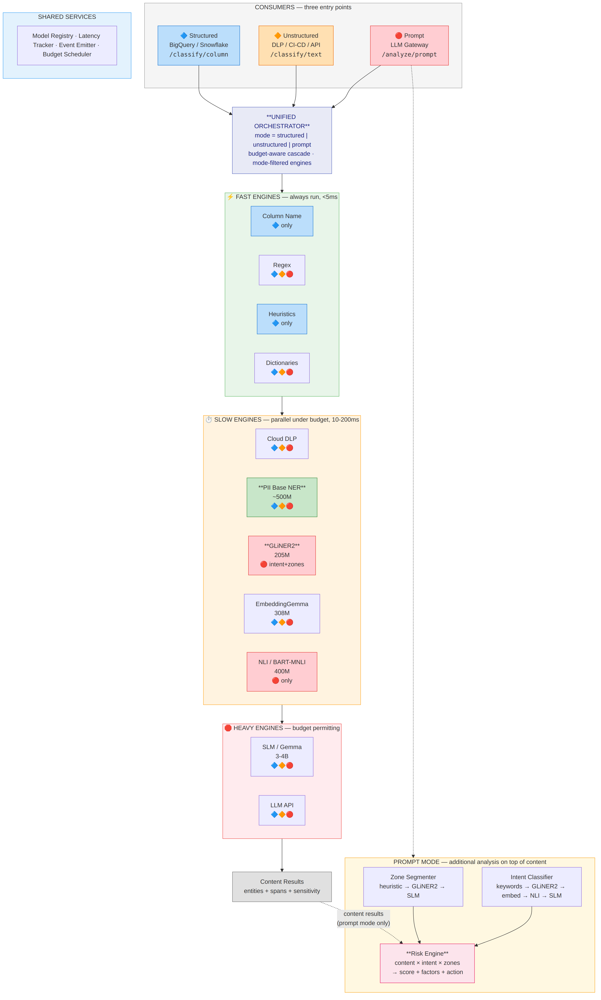
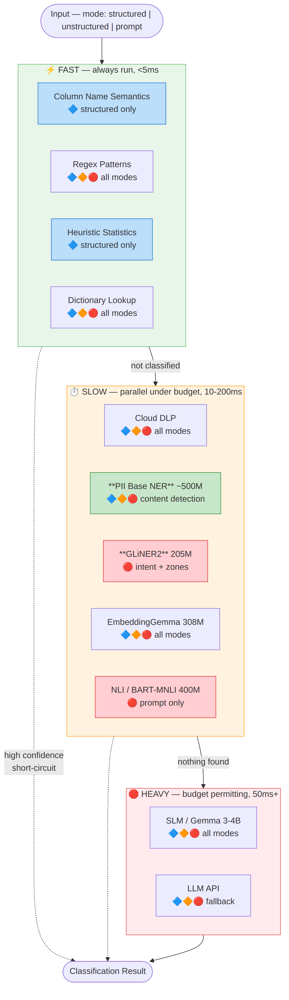
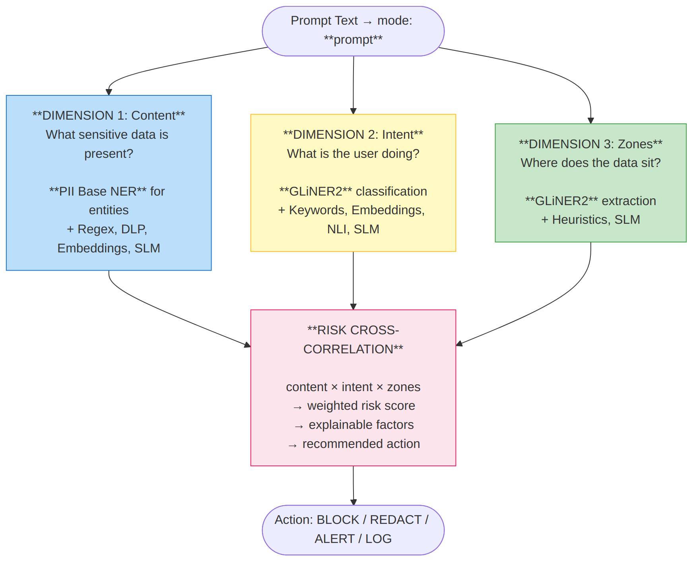
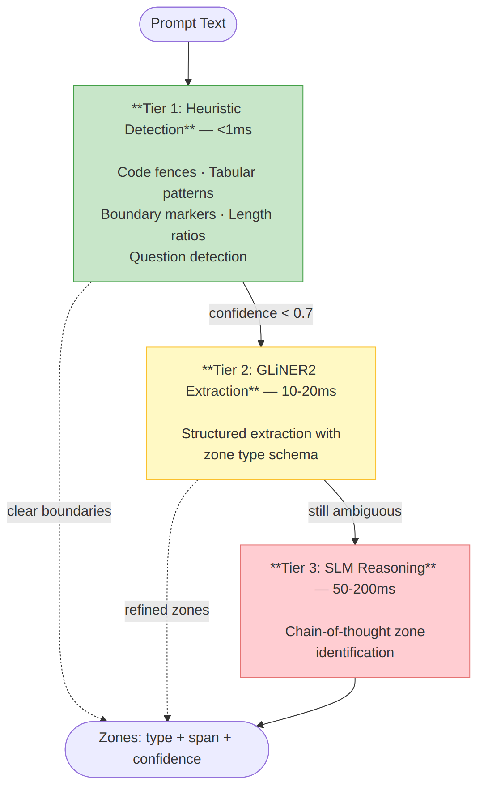
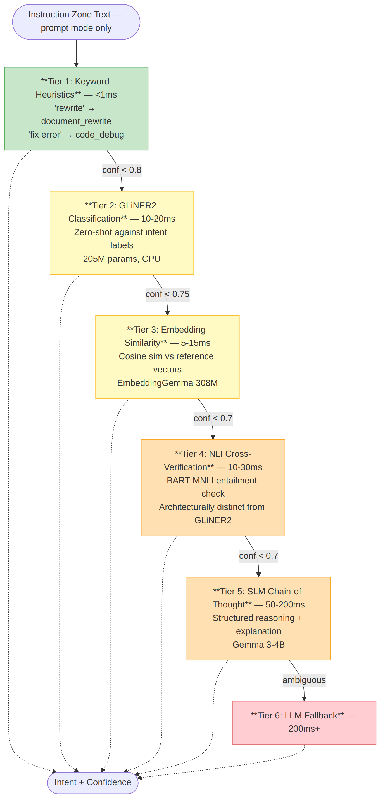
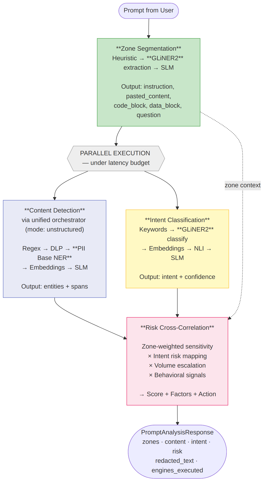
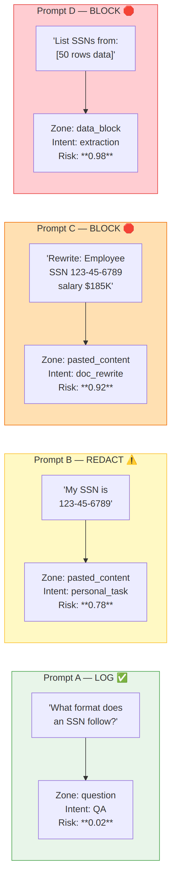
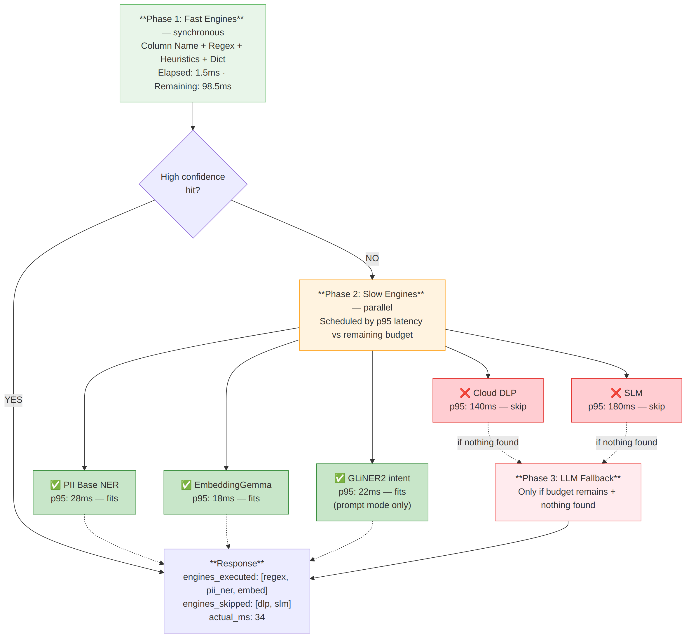

# Classification Library — Pipelines

Three pipelines serve three different analysis needs. A **unified orchestrator** with a `mode` flag (`structured|unstructured|prompt`) controls engine selection and cascade behavior. The mode flag enables/disables engines per pipeline — one orchestrator, one cascade logic, three behaviors.

**Dual model strategy:** PII base (~500M) handles NER for content detection across all pipelines (highest accuracy). GLiNER2 (205M) handles intent classification and zone extraction for the prompt pipeline. Both load by default in Standard+ profiles.



---

## Pipeline Overview

| Pipeline | Entry Point | Input | Output | Primary Consumer |
|----------|------------|-------|--------|-----------------|
| **Structured** | `/classify/column`, `/classify/table` | Column name, data type, sample values, statistics | Data category + sensitivity per column | BigQuery / Snowflake scanners |
| **Unstructured** | `/classify/text` | Free text blob | Entities with character-level spans + sensitivity | DLP pipelines, CI/CD gates, 3rd-party |
| **Prompt** | `/analyze/prompt` | Prompt text + optional behavioral signals | Zones + entities + intent + risk score | LLM prompt gateways |

---

## Pipeline 1: Structured (Column Classification)

### Purpose

Classify database columns by their data sensitivity. The scanner sends column metadata and sample values; the pipeline determines whether the column contains PII, PHI, PCI, credentials, or other sensitive data.

### Input

```python
ColumnInput(
    column_name="customer_ssn",
    data_type="STRING",
    table_name="customers",
    sample_values=["123-45-6789", "987-65-4321", "456-78-9012"],
    statistics={"cardinality": 45000, "null_ratio": 0.02, "avg_length": 11}
)
```

### Key Insight

Structured data is metadata-rich. Column name alone often suffices — a column named `customer_ssn` of type STRING doesn't need sample values to classify. The pipeline prioritizes metadata-heavy engines first and only examines sample values when metadata is inconclusive.

### Engine Flow



```
ALWAYS RUN (sequential, <10ms total):
  1. Column Name Semantics    ← primary for structured data
  2. Regex on sample values   ← formatted PII + known-format secrets
  3. Structured Secret Scanner← NEW: if samples contain config/JSON, parse and score key-value secrets
  4. Heuristic Statistics     ← cardinality, length, entropy signals
  5. Dictionary Lookup        ← consumer-specific sensitive values

IF NOT CLASSIFIED (parallel under budget):
  6. Cloud DLP on samples     ← context-aware, 150+ InfoTypes
  7. PII Base NER on samples  ← concatenated values as pseudo-text
  8. Embeddings on col name   ← semantic similarity to taxonomy

LAST RESORT (budget permitting):
  9. SLM reasoning            ← full context: name + type + samples + stats
  10. LLM fallback            ← novel types only
```

### Pipeline-Specific Behavior

**Column Name Semantics** is the primary engine. It handles ~40-60% of columns with high confidence, often without examining any data.

**Regex** runs on concatenated sample values. More effective here than in unstructured text because column values tend to be consistently formatted.

**Heuristic Statistics** leverages the columnar structure — cardinality, null ratio, length distribution are powerful signals unavailable in free text.

**GLiNER2 NER** operates in a supplementary role. Sample values are concatenated into a pseudo-text block. Less effective than in free-text mode, but catches entities in notes/description columns.

**Embeddings** compares the column name (not sample values) against the pre-computed taxonomy. Catches semantic matches that Column Name Semantics misses: "remuneration_pkg" → salary.

### Batch Mode

`/classify/table` accepts multiple columns from the same table and processes them as a batch. Table-level context (table name, other column classifications) can inform ambiguous cases — a column named "id" in a table classified as containing PII is more likely to be a sensitive identifier.

### Example

```
Input:   column_name="cust_dob", data_type="DATE", samples=["1985-03-15", "1992-11-22"]
Engine:  Column Name Semantics → match "dob" → date_of_birth (confidence: 0.92)
Result:  data_type: date_of_birth, sensitivity: confidential, tier: column_name
Time:    0.3ms (short-circuited, no further engines needed)
```

---

## Pipeline 2: Unstructured (Text Classification)

### Purpose

Detect sensitive entities in free-text content — documents, logs, emails, form fields, or any unstructured text. Returns entities with character-level spans for downstream redaction.

### Input

```python
classify_text(
    "Patient John Smith (DOB: 03/15/1985) was diagnosed with Type 2 diabetes. 
     Contact: john.smith@acme.com, SSN: 123-45-6789",
    budget_ms=100,
    return_spans=True,
    return_redacted=True
)
```

### Key Insight

Unstructured text has no metadata. There is no column name, no data type, no table context. The pipeline relies entirely on content analysis — pattern matching, entity recognition, and semantic understanding of the text itself. NER (GLiNER2) is the primary engine.

### Engine Flow

```
ALWAYS RUN (sequential, <10ms total):
  1. Structural Classifier     ← NEW: identify code/config/query/log/CLI/markup regions
  2. Boundary Detector          ← NEW: find content-type transitions in mixed text
  3. Regex Patterns             ← formatted PII + known-format secrets (AKIA, JWT, PEM)
  4. Structured Secret Scanner  ← NEW: parse detected structures → key-value → key-name + entropy
  5. Financial Density Scorer   ← NEW: currency + percentage + financial term clustering
  6. Dictionary Lookup          ← consumer-specific terms

IF NOT FULLY CLASSIFIED (parallel under budget):
  7. Cloud DLP                  ← context-aware detection, 150+ InfoTypes
  8. PII Base NER               ← PRIMARY: entity recognition with spans (names, medical, addresses)
  9. Embeddings                 ← topic sensitivity detection (MNPI, trade secrets, competitive intel)

LAST RESORT (budget permitting):
  10. SLM reasoning             ← ambiguous content, contextual analysis
  11. LLM fallback              ← genuinely novel types
```

### Pipeline-Specific Behavior

**Structural Classifier runs first** and informs downstream engines. If it identifies a code block, the Structured Secret Scanner parses for key-value secrets. If it identifies configuration, secret scanning is aggressive. If it identifies natural language, structural secret scanning is skipped.

**Boundary Detector** finds transitions in mixed content. A prompt with "Fix this error:" followed by a stack trace produces a boundary — enabling zone-aware scanning where the instruction is treated differently from the pasted code.

**Structured Secret Scanner** parses JSON, YAML, env, XML, SQL, CLI, HTTP headers, and code string literals. Extracts key-value pairs and scores each via key-name dictionary + Shannon entropy analysis. Catches secrets that have no known-format regex pattern (e.g., `DB_PASSWORD=kJ#9xMp$2wLq!`).

**PII Base NER** is the primary engine for unformatted entities — person names, medical conditions, organization names that regex cannot match. Returns character-level spans for redaction.

**Embeddings** detects topic-level sensitivity — text discussing merger details, trade secrets, or unpublished financial results. This is sensitivity that no entity detector finds because it's about what the text discusses, not specific entity instances.

**Column Name Semantics and Heuristic Statistics are not used** — they require columnar metadata that doesn't exist for free text.

### Span-Based Output

Every detected entity includes character offsets enabling precise redaction:

```json
{
  "results": [
    {"data_type": "person_name", "span": {"start": 8, "end": 18, "text": "John Smith"}, "confidence": 0.92},
    {"data_type": "ssn", "span": {"start": 95, "end": 106, "text": "123-45-6789"}, "confidence": 0.99}
  ],
  "redacted_text": "Patient [PERSON_NAME] (DOB: [DATE]) was diagnosed with [MEDICAL_CONDITION]..."
}
```

### Example

```
Input:   "Employee John Smith, SSN 123-45-6789, salary $185,000"
Regex:   SSN detected (123-45-6789), confidence 0.99
GLiNER2: person_name (John Smith, 0.92), salary ($185,000, 0.87)
Result:  3 entities, sensitivity: restricted (due to SSN)
Time:    22ms
```

---

## Pipeline 3: Prompt Analysis

### Purpose

Analyze prompts sent to public LLMs for data leakage risk. Goes beyond content detection by adding zone segmentation (where in the prompt the data sits) and intent classification (what the user is trying to do). The three analyses converge at a risk cross-correlation engine that produces an explainable risk score.

This pipeline is the domain of the Prompt Analysis Module. Full design rationale, approach theory, and research foundations are in doc 08.

### Input

```python
analyzer.analyze(
    "Rewrite this report:\nEmployee John Smith, SSN 123-45-6789, salary $185K",
    budget_ms=100,
    behavioral_signals={"prompt_volume_anomaly": 0.0, "after_hours": False}
)
```

### Key Insight

Content detection alone causes false positives. "What format does an SSN follow?" triggers SSN detection but has zero risk. "Rewrite this: SSN 123-45-6789" has critical risk. The difference is zone context (question vs. pasted content) and intent (question vs. document rewrite). Only a three-dimensional analysis correctly differentiates these cases.

### Engine Flow

The prompt pipeline is fundamentally different from structured and unstructured pipelines. Instead of a single cascade, it runs three parallel analyses that converge at a risk engine.



**Analysis 1: Zone Segmentation** — Where does the data sit?



```
  1. Heuristic Detection (<1ms)     ← code fences, tabular patterns, boundary markers
  2. GLiNER2 Extraction (10-20ms)   ← structured extraction with zone schema
  3. SLM Reasoning (50-200ms)       ← chain-of-thought for ambiguous cases

  Output: zones with types (instruction, pasted_content, code_block, data_block, question)
```

**Analysis 2: Content Detection** — What sensitive data is present?

Delegates to the unstructured pipeline (same engine flow). Runs in parallel with intent classification.

**Analysis 3: Intent Classification** — What is the user doing?



```
  1. Keyword Heuristics (<1ms)        ← "rewrite" → document_rewrite
  2. GLiNER2 Classification (10-20ms) ← zero-shot against intent labels
  3. Embedding Similarity (5-15ms)    ← cosine sim vs intent reference vectors
  4. NLI Cross-Verification (10-30ms) ← BART-MNLI entailment check
  5. SLM Chain-of-Thought (50-200ms)  ← structured reasoning
  6. LLM Fallback (200ms+)

  Output: intent label + confidence (document_rewrite, code_debug, extraction, etc.)
```

**Convergence: Risk Cross-Correlation** — All three analyses feed into the risk engine.



```
  Risk = f(content_severity × zone_weight × intent_risk × volume × behavioral_signals)

  Zone weights:    question=0.1, instruction=0.2, context=0.5, pasted_content=1.0, code=1.0, data=1.2
  Intent risks:    extraction=1.0, data_analysis=0.9, doc_rewrite=0.7, QA=0.1, brainstorming=0.1
  Score weights:   content 40%, intent 25%, volume 20%, behavioral 15% (consumer-configurable)
```

### Pipeline-Specific Behavior

**Zone segmentation runs first** — its results inform how content detection results are weighted in the risk engine. Content detection and intent classification run in parallel after zones are identified.

**GLiNER2 serves triple duty** — NER for content, classification for intent, extraction for zones. Single model instance, often a single forward pass for all three.

**NLI model is exclusive to this pipeline** — BART-MNLI provides architecturally distinct intent verification (entailment vs. span-matching), making the intent ensemble more robust.

**Cloud DLP is zone-focused** — When used, DLP scans only pasted_content and data_block zones, reducing API cost and avoiding false positives from instruction-zone mentions of PII concepts.

### Example: Same Entity, Different Risk



| Prompt | Zone | Intent | Risk | Action |
|--------|------|--------|------|--------|
| "What format does an SSN follow?" | question | QA | 0.02 | LOG |
| "My SSN is 123-45-6789" | pasted_content | personal | 0.78 | REDACT |
| "Rewrite: Employee SSN 123-45-6789, salary $185K" | pasted_content | doc_rewrite | 0.92 | BLOCK |
| "List all SSNs from: [50 rows]" | data_block | extraction | 0.98 | BLOCK |

A content-only system treats all four the same (SSN detected → ALERT). The prompt pipeline correctly differentiates all four.

---

## Cross-Pipeline Comparison

| Aspect | Structured | Unstructured | Prompt |
|--------|-----------|-------------|--------|
| **Primary signal** | Column metadata | Text content | Content × intent × zones |
| **Primary engine** | Column Name Semantics | GLiNER2 NER | GLiNER2 (triple duty) |
| **Engines not used** | — | Column Name, Heuristic Stats | Column Name, Heuristic Stats |
| **Exclusive engines** | Column Name, Heuristic Stats | — | NLI / BART-MNLI |
| **Output** | Category + sensitivity per column | Entities + spans | Zones + entities + intent + risk |
| **Typical latency** | <1ms (metadata hit) to 200ms | 5-100ms | 15-150ms |
| **Budget strategy** | Sequential cascade | Parallel slow tiers | Parallel content + intent |
| **Redaction** | Not applicable | Character-level spans | Character-level spans + zone-aware |
| **False positive strategy** | Metadata agreement | Multi-tier consensus | Zone + intent context |

---

## Budget-Aware Execution

All three pipelines share the same budget engine. Per-request `budget_ms` controls which engines run:



Fast engines always run (sequential, <5ms). Slow engines are scheduled in parallel based on their live p95 latency vs. remaining budget. If an engine's p95 would exceed the deadline, it's skipped. The LLM fallback only fires if budget remains and nothing was found.

Resource budgets (memory, CPU, API cost) are managed through profiles:

| Profile | Engines Available | Memory |
|---------|------------------|--------|
| **Free** | Regex, Column Name, Heuristics, Dictionaries | <256 MB |
| **Standard** | Free + Cloud DLP + GLiNER2 | ~800 MB |
| **Advanced** | Standard + Embeddings + SLM | ~3-5 GB |
| **Maximum** | Advanced + LLM fallback | ~3-5 GB |
