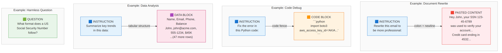
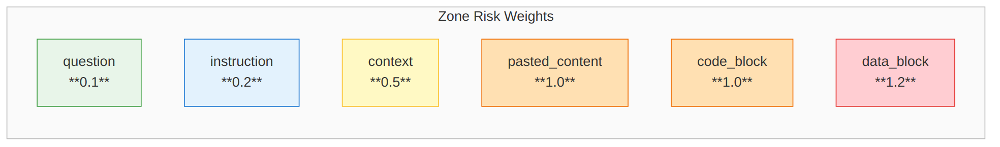
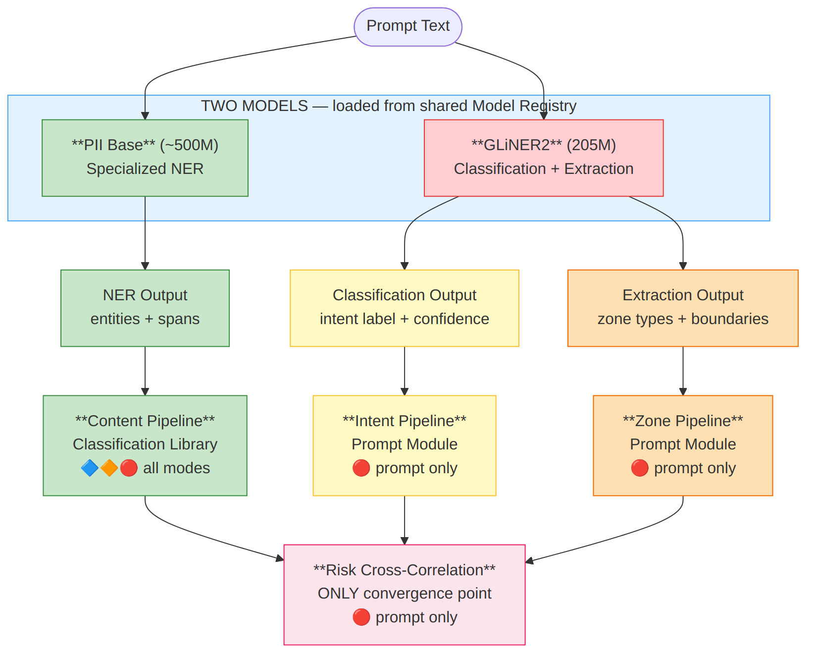

# Prompt Analysis Module — Design & Implementation Spec

**Version:** 1.0  
**Date:** April 2026  
**Status:** Design  
**Dependency:** Classification Library (content detection)

---

## Part 1: The Problem

### What Happens When Employees Use Public LLMs

Generative AI has become embedded in daily work. Employees use ChatGPT, Copilot, Claude, and Gemini to rewrite emails, debug code, analyze data, summarize reports, and translate documents. Industry data from 2025 shows approximately 18% of enterprise employees regularly paste data into GenAI tools, and over half of those paste events contain corporate information.

The data flows through browser-based interfaces as unstructured text — not as files or emails that conventional DLP can inspect. A prompt is simply a text block typed or pasted into a chat window. By the time it reaches the LLM provider's servers, the data has left the organization's control perimeter with no audit trail, no classification, and no policy enforcement.

The risk is not theoretical. Samsung engineers leaked proprietary semiconductor designs by pasting source code into ChatGPT. Financial analysts paste unreleased revenue projections when asking an LLM to "make this more professional." Engineers paste stack traces containing database connection strings, API keys, and customer session tokens. In each case, the employee's intent was benign — they were trying to do their job faster — but the data exposure was real.

### Why Traditional DLP Fails

Traditional Data Loss Prevention systems monitor file transfers, email attachments, USB activity, and network traffic for known patterns (credit card numbers, SSN formats). They fail on LLM prompts for three reasons.

**No file involved.** When an employee pastes text into ChatGPT, there is no file to scan. The data moves through the clipboard into a browser text field — a path DLP systems were never designed to monitor.

**Unstructured, mixed content.** A prompt blends instruction with pasted content. "Rewrite this report to be more concise:" followed by three paragraphs of confidential financial data. DLP sees one text block. It cannot distinguish the benign instruction from the sensitive pasted content.

**Context determines risk.** The sentence "What format does a US Social Security Number follow?" contains no PII despite mentioning SSNs. The sentence "My SSN is 123-45-6789" contains actual PII. Pattern matching alone cannot distinguish educational questions from data disclosure. Intent, structure, and context all matter.

### What Current Solutions Offer (and What's Missing)

The market has responded with three categories of tools, each addressing part of the problem:

**Endpoint DLP for LLMs** (Cyberhaven, Strac, Nightfall, Endpoint Protector) intercepts prompts at the browser or device level. These tools apply pattern matching and basic NER to detect PII, credentials, and source code in prompt text. They can block or redact. But they treat the prompt as a flat text block — a prompt asking about SSN formats triggers the same alert as a prompt containing actual SSNs. They have no concept of intent, no understanding of prompt structure, and no zone-aware risk assessment.

**LLM security guardrails** (OWASP framework, Preamble PromptArmor, Datadog AI Guard, Lakera) focus on prompt injection detection and jailbreak prevention. They use intent classification, but only for security intents — "is this an attack?" — not data-handling intents — "is the user pasting a spreadsheet for summarization?" They protect the LLM from malicious users but do not protect the organization from accidental data leakage by legitimate users.

**Context-Based Access Control (CBAC)** is an emerging pattern in enterprise AI where access decisions are made dynamically based on user role, query intent, and data sensitivity. This is the closest to what we need, but it is implemented within RAG pipelines and enterprise LLM deployments — not as a standalone analysis capability for monitoring prompts to external LLMs.

**The gap:** No existing tool combines content detection + structural intent classification + zone-aware risk assessment as a reusable, general-purpose analysis capability. Everyone either does content-only (DLP) or security-only (guardrails). The intersection — understanding what data is present, what the user is trying to do, and where in the prompt the data sits — is unaddressed.

---

## Part 2: The Approach

### Three Dimensions of Prompt Analysis

To assess the risk of a prompt, we need to answer three independent questions. Each question is answered by a different analysis, using different methods, producing different outputs. They converge only at the risk assessment stage.


**Dimension 1: Content Detection** — What sensitive data is in the prompt?

This is the classification library's job. Regex finds formatted PII (SSNs, credit cards, API keys). GLiNER2 finds named entities (person names, medical conditions). Embeddings detect sensitive topics (MNPI, trade secrets). The output is a list of detected entities with character-level spans, data categories, and confidence scores.

**Dimension 2: Intent Classification** — What is the user trying to do?

A user who types "What's the format of an SSN?" has a different intent from a user who types "Rewrite this HR report." The first is a question. The second is a document rewrite that likely includes pasted sensitive content. Understanding intent is essential because the same detected entity carries fundamentally different risk depending on why it appears in the prompt.

**Dimension 3: Zone Segmentation** — Where in the prompt does the data sit?

A prompt is not homogeneous. It has structural zones: the instruction the user gives the LLM, the content they paste from another source, code blocks, tabular data blocks, and contextual framing. An SSN mentioned in an instruction ("detect SSNs in this text") is categorically different from an SSN in pasted content ("John Smith, SSN 123-45-6789"). Zone segmentation identifies these structural regions so that content findings can be weighted by their location.

These three analyses are independent. Content detection does not depend on intent. Intent does not depend on what entities are found. Each produces its own output. They converge at a fourth stage:

**Convergence: Risk Cross-Correlation** — How risky is this combination?

Risk is a function of content × intent × zone. A restricted entity (SSN) found in pasted content (high-risk zone) during a document rewrite (high-risk intent) is critical. The same entity mentioned in a question (low-risk zone) about data formatting (low-risk intent) is benign. The risk engine is the only place these dimensions meet, and its logic is explicit, configurable, and explainable.

### Why Separation Matters

It is tempting to build a single model that takes a prompt and outputs a risk score. But collapsing these dimensions creates problems.

**Testability degrades.** If content detection and intent classification are entangled, you cannot independently measure false positive rates for PII detection vs. intent misclassification. A regression in intent accuracy looks identical to a regression in entity detection.

**Reusability is lost.** The classification library serves multiple consumers — scanners, DLP pipelines, CI/CD gates. If intent logic is baked into content detection, those consumers inherit prompt-specific behavior they don't need.

**Explainability suffers.** A composite risk score from a black-box model tells the security team "risk: 0.87" but not why. Separated dimensions produce auditable explanations: "restricted entity (SSN) found in pasted_content zone during document_rewrite intent."

**Tuning becomes difficult.** An organization that wants to change how document rewrites are treated shouldn't have to retrain the entity detection model. Separated concerns have independent configuration surfaces.

---

### Approach to Zone Segmentation

#### The Instruction-Data Separation Problem

The ICLR 2025 paper **"Can LLMs Separate Instructions from Data?"** [Willison et al., ICLR 2025] formalizes a fundamental limitation: current LLMs process all input tokens as an undifferentiated sequence with no inherent distinction between instructions and data. The paper defines a formal framework where a language model should be a mapping `g : A* × A* → M(A*)` with distinct instruction and data arguments, and demonstrates that existing models fail to enforce this separation — leading to undesirable behaviors including prompt injection and unintended data execution.

The companion paper **"Improving LLM Safety with Instructional Segment Embedding"** [Chen et al., ICLR 2025] proposes an architectural solution: adding learned segment embeddings that classify each token by its role (system instruction = 0, user prompt = 1, data input = 2). This approach, applied during supervised fine-tuning, enables models to better distinguish and prioritize instructions based on privilege level.

Our problem is the inverse of the ISE approach. We do not control the LLM — we observe prompts destined for external LLMs (ChatGPT, Copilot, etc.). We need to reconstruct the zone structure from the outside, based on the text alone, before the prompt reaches the LLM.

#### What Zones Look Like in Real Prompts




A prompt is composed of structurally distinct regions. Here are the six zone types with annotated examples:

**Example 1 — Document Rewrite (clear boundaries)**

> INSTRUCTION
> Rewrite this email to be more professional and concise:
> PASTED_CONTENT
> Hey John, just wanted to let you know your SSN 123-45-6789
> was used to verify your account. Your credit card ending in
> 4532 was charged $299.99 on March 15. Let me know if you
> have questions about the charge.
> Boundary signal: colon + newline between short instruction and
> longer pasted content. Format shift from casual to formal.

**Example 2 — Code Debug (structural markers)**

> INSTRUCTION
> Fix the error in this Python code:
> CODE_BLOCKpython                                                      │
│ import boto3                                                   │
│ client = boto3.client('s3',                                    │
Boundary signal: code fences. Unambiguous structural marker. Intent: code_debug. Content: AWS credentials.


**Heuristic detection** (<1ms) handles the clear cases instantly — Examples 1, 2, 3, 4, and 6 above are all detectable by heuristics alone.

**GLiNER2 structured extraction** (10-20ms) handles ambiguous cases like Example 5, treating zone segmentation as a structured data extraction task. Reference: **GLiNER2 (EMNLP 2025)** demonstrated that a single 205M parameter encoder model can perform NER, text classification, and structured extraction simultaneously through a schema-driven interface.

**SLM reasoning** (50-200ms) handles edge cases where neither heuristics nor GLiNER2 produce confident segmentation.

---

### Approach to Intent Classification

#### What Intent Really Means

The word "intent" is misleading. In chatbot systems, intent means "what action does the user want?" (book_flight, check_balance). In prompt security analysis, intent means something fundamentally different: **why is this data in this prompt?**

The question matters because the same detected entity — an SSN, a credential, a financial figure — carries completely different risk depending on the answer:

- "Rewrite this: Employee SSN 123-45-6789" — the SSN is **operational data submitted for LLM processing.** It is leaving the organization. This is a data leak.
- "What's the penalty for exposing an SSN?" — the SSN is **a concept being referenced.** Nothing is leaving. This is not a leak.
- "I accidentally saw SSN 123-45-6789 in our system, what should I do?" — the SSN is **contextual evidence in a question.** It is leaving, but the user's goal isn't data processing. This is an inadvertent leak.

Task type classification (document_rewrite, code_debug, question_answering) is actually a **proxy for a more fundamental property: data flow direction.**

#### Data Flow Direction — The Real Signal

There are three data flow directions in LLM prompts:

**1. Data → LLM for processing** (rewrite, summarize, translate, analyze, debug, format)

The user is sending organizational data TO the LLM for it to do something with. This is the primary leakage vector. The data will be stored in the LLM provider's logs, potentially cached, possibly used for training. Every entity in the submitted data represents real exposure.

Task types: `document_rewrite`, `summarization`, `translation`, `data_analysis`, `code_debug`, `formatting`

**2. User → LLM for knowledge** (question, brainstorm, content creation)

The user is asking the LLM for information or ideas. No organizational data flows outward (usually). The prompt contains instructions and questions, not pasted content. Entities detected here are almost always concept references, not actual data.

Task types: `question_answering`, `brainstorming`, `content_creation`

**3. Data → LLM for extraction** (list all names, extract emails, find patterns)

The user is sending data AND asking the LLM to systematically surface specific information. This is the most dangerous pattern — it implies the user intends to extract and use the data elsewhere. It's the behavioral signature of both legitimate data processing and intentional exfiltration.

Task types: `extraction`, `data_analysis` (when combined with extraction-like phrasing)

#### Task Type: Both Proxy and Independent Signal

Task type serves two distinct roles in risk assessment:

**Role 1: Proxy for data flow direction.** Task types like `document_rewrite` and `code_debug` imply that data is flowing outward (Data → LLM for processing). Task types like `question_answering` imply no data flow (User → LLM for knowledge). This is the binary gate — if direction is "knowledge," risk is low regardless of what else is happening.

**Role 2: Independent signal about the NATURE of the risk.** Even within the same direction, different task types predict different risk profiles:

| Task Type | Direction (same) | What Task Type Adds |
|-----------|:----------------:|---------------------|
| `code_debug` | Data → LLM | Predicts credentials, schemas, internal architecture in the pasted content |
| `document_rewrite` | Data → LLM | Predicts prose documents — contracts, reports, internal communications |
| `data_analysis` | Data → LLM | Predicts structured records — CSV/JSON with PII, financial data, customer records |
| `summarization` | Data → LLM | Predicts full document exposure — the LLM sees everything |
| `extraction` | Data → LLM | Predicts systematic harvesting — user wants specific data surfaced and organized |
| `translation` | Data → LLM | Predicts IP or legal content that needs to cross language boundaries |

The task type tells the risk engine **what kind of sensitive data to expect before content detection runs.** A `code_debug` prompt with no detected credentials is probably safe. A `code_debug` prompt with a detected API key confirms the predicted risk. A `data_analysis` prompt with no detected PII might still be risky if the data contains proprietary business metrics that NER can't catch.

Task types also signal **the user's processing pattern:**
- `extraction` = harvesting (user wants the LLM to mine data and surface specific items). Most dangerous — it's the behavioral signature of both legitimate data processing and intentional exfiltration.
- `summarization` = reduction (full document goes in, condensed version comes out). High exposure but the output is smaller than the input.
- `translation` = transformation (full document passes through unchanged semantically). High exposure, the output contains everything the input contains.
- `document_rewrite` = modification (content goes in, modified version comes out). The LLM sees everything.
- `code_debug` = troubleshooting (code + error go in, explanation/fix comes out). The sensitive content is incidental to the goal — the user wants help, not data.

So **direction answers "is data flowing outward?"** and **task type answers "given that data IS flowing, what's the nature of the exposure?"**

**How the three signals relate:**

```
Direction (from task type):  Is data flowing outward?
                             ├── NO  → Low risk (knowledge request)
                             └── YES → Check task type + zones + content
                                       │
Task type (independent):     What kind of exposure?
                             ├── extraction → systematic harvesting (CRITICAL)
                             ├── code_debug → credentials/architecture risk
                             ├── data_analysis → structured records/PII risk  
                             ├── document_rewrite → full document exposure
                             └── ...
                                       │
Zones (structural check):   Does the prompt structure confirm?
                             ├── pasted_content zone detected → confirms outward flow
                             ├── code_block zone detected → confirms code risk
                             ├── data_block zone detected → confirms bulk data risk
                             └── question zone only → overrides: probably not a real leak
                                       │
Content (ground truth):      What entities are actually present?
                             └── SSN, API key, financial data, person names, etc.
```

All four signals converge at the risk cross-correlation engine. Direction is the gate. Task type is the risk characterization. Zones are the structural confirmation. Content is the ground truth.

The mapping from task type to direction:

| Data Flow Direction | Risk Level | Task Types |
|--------------------|-----------|--------------------|
| **Data → LLM for extraction** | CRITICAL | extraction |
| **Data → LLM for processing** | HIGH | document_rewrite, summarization, translation, code_debug, formatting, data_analysis |
| **User → LLM for knowledge** | LOW | question_answering, brainstorming, content_creation |

Zones provide an **independent check**. If the task type suggests "question_answering" (low risk) but the boundary detector found a large pasted_content zone, the data flow direction is actually "processing" not "knowledge" — the user asked a question but also pasted data. Zones override the task type inference.

#### Intent Taxonomy Design

Intent labels must satisfy three constraints. They must be **structurally detectable** — inferable from the prompt's text and structure rather than requiring external knowledge. They must be **risk-relevant** — each intent maps to a data flow direction AND predicts the nature of the risk. And they must be **extensible** — consumers can add organization-specific intents without retraining.

The shipped taxonomy, organized by data flow direction:

**Data → LLM for processing (HIGH risk when sensitive data present):**

| Intent | What It Means | Independent Risk Signal |
|--------|-------------|----------------------|
| `document_rewrite` | User pasted text and wants it modified | Full document exposure — prose, contracts, reports, communications |
| `summarization` | User pasted text to be condensed | Full document exposure — LLM sees everything |
| `translation` | User pasted text for language conversion | IP, legal, or internal content crossing language boundary |
| `code_debug` | User pasted code/logs for troubleshooting | Credentials, schemas, architecture, internal paths |
| `data_analysis` | User pasted data for analysis/visualization | Structured records — PII, financial data, customer data |
| `formatting` | User wants format conversion | Content sensitivity depends on source |

**User → LLM for knowledge (LOW risk):**

| Intent | What It Means | Why It's Low Risk |
|--------|-------------|------------------|
| `question_answering` | User asks a factual question | Typically no organizational data flows outward |
| `brainstorming` | User explores ideas with the LLM | Generative — no pasted data |
| `content_creation` | User asks LLM to generate new content | Generative — no pasted data |

**Data → LLM for extraction (CRITICAL risk):**

| Intent | What It Means | Why It's Critical |
|--------|-------------|------------------|
| `extraction` | User wants specific data pulled from content | Systematic harvesting pattern — "list all names and emails" |

Consumers extend this with organization-specific intents. A financial services firm adds "board_preparation" (HIGH — MNPI likely). A healthcare organization adds "clinical_note_processing" (HIGH — PHI likely). These custom intents are injected at initialization, same as custom entity labels in the classification library.

#### Intent Classification Methods

Research identifies five approaches to text intent classification, each with different accuracy/cost tradeoffs. Our tiered architecture uses all five in cascade.


#### Multi-Tier Confidence Resolution

When multiple intent tiers produce results, confidence resolution follows a principled strategy. If any tier exceeds 0.9 confidence, its result is authoritative. If multiple tiers agree on the same intent, confidence is boosted. If tiers disagree, the higher-authority tier (SLM > NLI > GLiNER2 > embeddings > keywords) takes precedence, but disagreement itself is logged as a signal — it may indicate a genuinely ambiguous or novel prompt type that warrants human review.

---

### Approach to Risk Cross-Correlation

#### The Core Insight: Risk Is a Product, Not a Sum

A prompt's risk is not determined by its most sensitive entity alone, nor by its intent alone, nor by its structure alone. Risk emerges from the interaction of all three.

Consider four prompts that all mention "SSN." A content-only system treats all four the same. Content + intent improves. Content + intent + zones is the only approach that correctly differentiates all four:


**Prompt A — Harmless question:**
> QUESTION
> What format does a US Social Security Number follow?
> Content:  "Social Security Number" detected (concept mention, not actual PII)
> Intent:   question_answering (risk: 0.1)
> Zone:     question (weight: 0.1)
> Risk:     0.02 → action: LOG (no concern)

**Prompt B — Personal disclosure:**
> INSTRUCTION
> Help me fill this tax form:
> PASTED_CONTENT
> My SSN is 123-45-6789
> Content:  SSN detected (actual PII, sensitivity: restricted)
> Intent:   document_rewrite (risk: 0.7)
> Zone:     pasted_content (weight: 1.0)
> Risk:     0.78 → action: REDACT

**Prompt C — Multi-PII document rewrite:**
> INSTRUCTION
> Rewrite this report:
> PASTED_CONTENT
> Employee John Smith, SSN 123-45-6789, salary $185,000.
> Performance rating: exceeds expectations.
> Manager: Jane Doe (jane.doe@acme.com)
> Content:  SSN + person_name + salary + email (4 PII types, sensitivity: restricted)
> Intent:   document_rewrite (risk: 0.7)
> Zone:     pasted_content (weight: 1.0)
> Risk:     0.92 → action: BLOCK
> Factors:  restricted_entities_in_pasted_content, multiple_pii_types: 4

**Prompt D — Bulk data extraction:**
> INSTRUCTION
> List all employees with salary > $150K from this data:
> DATA_BLOCK
> Name, SSN, Department, Salary
> John Smith, 123-45-6789, Engineering, $185,000
> Jane Doe, 987-65-4321, Marketing, $165,000
> ... (48 more rows)
> Content:  50× SSN + 50× person_name + 50× salary (bulk PII, sensitivity: restricted)
> Intent:   extraction (risk: 1.0)
> Zone:     data_block (weight: 1.2 — volume escalation)
> Risk:     0.98 → action: BLOCK
> Factors:  restricted_entities_in_data_block, extraction_intent, bulk_data: 50_records

These four prompts demonstrate why all three dimensions are necessary:

| System | Prompt A | Prompt B | Prompt C | Prompt D |
|--------|----------|----------|----------|----------|
| Content-only | ALERT ❌ | ALERT ✓ | ALERT ✓ | ALERT ✓ |
| Content + Intent | LOG ✓ | REDACT ✓ | REDACT ≈ | BLOCK ✓ |
| Content + Intent + Zones | LOG ✓ | REDACT ✓ | BLOCK ✓ | BLOCK ✓ |

Content-only produces a false positive on Prompt A (SSN concept mention triggers alert). Content + Intent correctly handles A and B but underscores C (same intent as B, but more entities). Only the full three-dimensional analysis correctly differentiates all four cases — scoring C higher than B due to entity volume, and D highest due to extraction intent + data_block zone + bulk volume.

#### Zone-Weighted Sensitivity

Entities carry different risk depending on where in the prompt they appear:



The rationale:

- **question (0.1)** — "What's the penalty for SSN exposure?" mentions SSN as a concept, not actual PII. Nearly zero risk.
- **instruction (0.2)** — "Detect SSNs in this text" references PII types in an instruction. Low risk — the user is describing a task, not disclosing data.
- **context (0.5)** — "This is for the Acme Corp account" names a real client. Moderate risk — context may reveal business relationships.
- **pasted_content (1.0)** — Text copied from another source is the primary leakage vector. Every entity here represents real data leaving the organization.
- **code_block (1.0)** — Credentials and architecture details in code represent direct security exposure.
- **data_block (1.2)** — Tabular data blocks represent bulk exposure. The elevated weight reflects volume risk — 50 rows of customer records is categorically worse than a single name.

#### Intent Risk Mapping

Each intent carries an inherent risk level derived from its **data flow direction** — the fundamental property that determines whether organizational data is leaving the organization:

**Data → LLM for extraction (CRITICAL):**

| Intent | Risk Level | Rationale |
|--------|-----------|-----------|
| extraction | 1.0 | Systematic data harvesting — "list all SSNs from this data" |

**Data → LLM for processing (HIGH):**

| Intent | Risk Level | Rationale |
|--------|-----------|-----------|
| data_analysis | 0.9 | Bulk data submitted for processing |
| document_rewrite | 0.7 | Full documents pasted — primary leakage pattern |
| summarization | 0.7 | Full documents pasted |
| code_debug | 0.6 | Code may contain credentials, schemas, architecture |
| translation | 0.5 | Content may be IP, contracts, internal communications |
| formatting | 0.4 | Content varies in sensitivity |

**User → LLM for knowledge (LOW):**

| Intent | Risk Level | Rationale |
|--------|-----------|-----------|
| brainstorming | 0.1 | No organizational data flows outward |
| question_answering | 0.1 | Concept references, not actual data (usually) |
| content_creation | 0.05 | Generative — user is requesting output, not submitting data |

**Important:** These risk levels are the intent component only. They are multiplied with content severity (what entities were found) and zone weight (where the entities sit). A `question_answering` intent with 0.1 risk still escalates if a pasted_content zone is detected — because zones override the task type inference when they indicate data is flowing outward despite the apparent intent. This is the triangulation principle: intent is a proxy, zones are a check on the proxy, and content is ground truth.

#### Behavioral Context

Content, intent, and zones describe a single prompt. Behavioral context describes the pattern across prompts over time. The prompt analysis module does not own behavioral tracking — that is the consumer's domain (they have the user database, session history, and organizational context). But the module accepts behavioral signals as optional input and incorporates them into risk scoring.

Key behavioral signals include prompt volume anomaly (user submitting 10x their normal rate), after-hours activity (sensitive prompts outside business hours), cumulative session sensitivity (multiple prompts in one session, each extracting different data), and paste size (large clipboard content suggests bulk data transfer). Reference: OWASP LLM Top 10 (2025), LLM02: Sensitive Information Disclosure recommends monitoring for behavioral patterns that indicate systematic data exfiltration.

The composite risk score weights content (40%), intent (25%), volume (20%), and behavioral signals (15%). These weights are consumer-configurable — an organization that prioritizes behavioral detection over content detection can adjust accordingly.

#### Explainable Risk Factors

Every risk score includes human-readable factors that explain why the score was assigned. This is critical for security teams who need to understand, audit, and act on alerts. A score of 0.87 is opaque. A score of 0.87 with factors ["restricted_entity_in_pasted_content: SSN", "high_risk_intent: document_rewrite", "multiple_pii_types: 3"] is actionable.

---

### Research Foundations

The prompt analysis approach draws on research from multiple fields:

| Research | Contribution to Our Design |
|----------|---------------------------|
| **"Can LLMs Separate Instructions from Data?"** [ICLR 2025] | Formalizes instruction-data separation as `g : A* × A*`, proves current LLMs fail at it. Validates zone segmentation as a real, necessary problem. |
| **"Instructional Segment Embedding"** [ICLR 2025] | Token-level role classification (system=0, user=1, data=2). Proves segment awareness improves LLM safety. Our approach: external reconstruction rather than internal embedding. |
| **GLiNER2** [EMNLP 2025] | 205M parameter model for unified NER + text classification + structured extraction. Enables single-pass content detection + intent classification + zone extraction. |
| **"Benchmarking Zero-shot Text Classification"** [EMNLP 2019] | NLI-based zero-shot classification via entailment. Foundation for our NLI intent verification tier. |
| **Intent-Based Defense Paradigm (IBD)** [2025] | Demonstrates that LLM intent analysis reduces attack success rate by 74%. Validates intent classification as a security-relevant capability. |
| **LLM-as-a-Judge** [2025] | Structured chain-of-thought reasoning for safety evaluation. Our SLM tier uses CoT for intent reasoning on ambiguous cases. |
| **OWASP LLM Top 10 (2025) — LLM02** | Sensitive Information Disclosure framework. Establishes that prompt inputs are a threat vector alongside outputs. |
| **CBAC (Context-Based Access Control)** [2025-2026] | Dynamic access decisions based on user role + query intent + data sensitivity. Our risk engine implements a similar cross-correlation model. |
| **LayerX Enterprise AI Report (2025)** | 18% of employees paste data into GenAI; 50%+ of paste events contain corporate information. Quantifies the scale of the problem our module addresses. |
| **RECAP: Hybrid PII Detection** [2025] | Regex for structured PII + LLM for unstructured, per-locale. Validates our hybrid tiered approach. |
| **Sherlock / Sato / CASSED** [2020-2023] | Column semantic type detection using multi-signal classification (metadata + statistics + embeddings + NER). Our classification library's multi-tier approach for structured data draws from this lineage. |

---

## Part 3: Design Principle — Separation of Concerns

Content detection and intent classification are parallel, independent analyses that share infrastructure but do not depend on each other.

An SSN is an SSN regardless of whether the user is rewriting a document or asking a question. Content detection produces the same results independent of intent. Intent classification produces the same results independent of what entities are found. Only the risk layer combines them — and that combination is explicit, auditable, and consumer-configurable.



GLiNER2 can perform NER, text classification, and structured extraction in a single forward pass. This is an implementation optimization — one model call instead of three. But architecturally, the outputs route to separate result streams: entity detections go to the content pipeline, intent classification goes to the intent pipeline, zone extraction goes to the zone pipeline. The consumer of content detection (e.g., a DLP pipeline) never sees intent results. The prompt module's risk engine is the only component that reads all three streams.


---

## Part 4: Module Structure & Implementation


### Shared Infrastructure

The module reuses classification library infrastructure. No duplication of models or observability systems.

| Component | Shared How |
|-----------|-----------|
| GLiNER2 model instance | Single load, dual use: NER for content + classification/extraction for intent/zones |
| EmbeddingGemma instance | Topic sensitivity (content) + semantic intent matching (prompt module) |
| SLM (Gemma) instance | Content reasoning + intent reasoning + zone reasoning |
| Event emitter | Same handlers, different event types (PromptAnalysisEvent) |
| Latency tracker | Same tracker, budget-aware scheduling for prompt module tiers |
| Config injection | Same pattern: consumer provides custom intents, zone rules, risk policies |

---

## Module Architecture

```
prompt_analysis/
├── __init__.py                  # PromptAnalyzer export
├── models.py                    # Zone, Intent, RiskScore, PromptAnalysisResponse
├── prompt_orchestrator.py       # Coordinates all phases, budget-aware
├── zone_segmenter.py            # Phase 1: structural zone detection
│   ├── heuristic_zones.py       #   Fast: regex + structural patterns
│   └── model_zones.py           #   GLiNER2 structured extraction
├── intent_classifier.py         # Phase 2: intent classification
│   ├── heuristic_intent.py      #   Fast: keyword/pattern matching
│   ├── gliner2_intent.py        #   GLiNER2 text classification
│   ├── embedding_intent.py      #   Semantic similarity to intent reference vectors
│   ├── nli_intent.py            #   Entailment cross-verification
│   └── slm_intent.py            #   SLM chain-of-thought reasoning
├── risk_engine.py               # Phase 3: cross-correlates content × intent × zones
├── api.py                       # FastAPI endpoints
└── events.py                    # PromptAnalysisEvent types
```

---

## Phase 1: Zone Segmentation

Zone types and the theoretical background for zone segmentation are described in Part 2. This section covers the tiered implementation.

### Tiered Approach

#### Tier 1: Heuristic Zone Detection (Fast, <1ms)

Structural patterns that reliably indicate zone boundaries:

**Instruction-to-content boundary markers:**
- Colon followed by newline: `"Rewrite this:\n"` → boundary after colon
- Quoting patterns: text in triple quotes, blockquotes, or indentation shifts
- Explicit delimiters: `"Here is the text:"`, `"Document:"`, `"Data:"`, `"Code:"`
- Length discontinuity: short instruction line followed by much longer text block

**Code block detection:**
- Code fences: triple backticks with optional language identifier
- Indentation-based: consistent 2/4-space indentation blocks
- Syntax signals: import statements, function definitions, class declarations, variable assignments
- Error patterns: stack traces, exception messages, log lines with timestamps

**Data block detection:**
- Tabular structure: consistent delimiter patterns (comma, tab, pipe) across multiple lines
- Header row: first line with distinct formatting from subsequent lines
- Repeated structure: lines with same number of fields
- JSON/XML blocks: bracket/brace patterns

**Question detection:**
- Ends with question mark
- Starts with interrogative words: what, how, why, when, where, who, can, should, is

**Implementation:**

```python
@dataclass
class Zone:
    type: str           # instruction, pasted_content, code_block, data_block, context, question
    start: int          # character offset
    end: int            # character offset
    text: str
    confidence: float   # how sure we are about the zone type
    method: str         # "heuristic" or "gliner2"

class HeuristicZoneSegmenter:
    def segment(self, text: str) -> list[Zone]:
        zones = []
        # 1. Detect code fences (highest confidence structural markers)
        # 2. Detect tabular data blocks
        # 3. Detect instruction-content boundaries
        # 4. Remaining text: classify as instruction, context, or question
        return zones
```

#### Tier 2: GLiNER2 Structured Extraction (10-20ms)

When heuristic segmentation is ambiguous (e.g., no clear boundary markers, mixed content), GLiNER2's structured extraction capability can parse zones:

```python
zone_schema = {
    "prompt_zones": [
        "instruction::str::The user's directive or request to the LLM",
        "pasted_content::str::Text that appears to be copied from another source",
        "code_block::str::Source code, configuration, or log output",
        "data_block::str::Tabular or structured data like CSV rows",
        "context::str::Background information or constraints"
    ]
}
result = gliner2.extract_json(text, zone_schema)
```

This runs only when heuristic confidence is below threshold (e.g., <0.7) on any zone.

#### Tier 3: SLM Zone Reasoning (50-200ms, budget-dependent)

For genuinely ambiguous prompts where neither heuristics nor GLiNER2 produce confident zones, the SLM reasons about structure:

```
Identify the structural zones in this prompt. For each zone, specify the type
(instruction, pasted_content, code_block, data_block, context, question)
and the exact text span.

Prompt: {text}

Respond with JSON only.
```

---

## Phase 2: Intent Classification

The intent taxonomy, classification methods, and confidence resolution strategy are described in Part 2. This section covers the tiered implementation.

### Consumer-Extensible Intents

Consumers add custom intents via configuration, same as custom entity labels:

```json
"custom_intents": [
    {"label": "board_preparation", "description": "Preparing materials for board meetings", "risk": "high"},
    {"label": "legal_review", "description": "Analyzing legal documents or contracts", "risk": "high"},
    {"label": "competitive_analysis", "description": "Analyzing competitor information", "risk": "medium"}
]
```

### Tiered Approach

Intent classification follows the same cascading philosophy as content detection: cheap/fast first, expensive/accurate as fallback.

#### Tier 1: Keyword Heuristics (<1ms)

Pattern-matching on instruction zone text:

```python
INTENT_PATTERNS = {
    "document_rewrite": [
        r"\b(rewrite|rephrase|revise|improve|edit|make .+ more)\b",
        r"\b(proofread|polish|clean up|refine)\b"
    ],
    "code_debug": [
        r"\b(fix|debug|error|bug|exception|traceback|stack trace)\b",
        r"\b(what's wrong|doesn't work|failing|broken)\b"
    ],
    "summarization": [
        r"\b(summarize|summary|condense|shorten|brief|tldr|tl;dr)\b"
    ],
    "translation": [
        r"\b(translate|translation|in (spanish|french|german|chinese|japanese))\b"
    ],
    "extraction": [
        r"\b(list all|extract|find all|pull out|identify every)\b"
    ],
    "data_analysis": [
        r"\b(analyze|analysis|trend|pattern|insight|visualize|chart)\b"
    ],
    "question_answering": [
        r"^(what|how|why|when|where|who|can|should|is|are|does|do)\b"
    ],
}
```

Returns the matched intent with confidence based on match strength (multiple keyword hits → higher confidence). If only one weak match → low confidence, pass to next tier.

#### Tier 2: GLiNER2 Text Classification (10-20ms)

Zero-shot text classification against intent labels. Uses the same GLiNER2 instance loaded for content NER.

```python
intent_labels = [
    "document rewrite or editing",
    "code debugging or troubleshooting",
    "data analysis or visualization",
    "text summarization",
    "language translation",
    "data extraction from document",
    "creative content generation",
    "question answering",
    "brainstorming ideas"
]
# + consumer-defined custom intent labels

result = gliner2.classify(text, intent_labels)
# Returns: {"label": "document rewrite or editing", "score": 0.87}
```

#### Tier 3: Embedding Similarity (5-15ms)

Embed the prompt (or just the instruction zone) against pre-computed intent reference vectors:

```python
INTENT_EMBEDDINGS = {
    "document_rewrite": embed(["rewrite this document", "make this more professional",
                                "edit this email", "improve this text"]),
    "code_debug": embed(["fix this code", "debug this error", "what's wrong with this function",
                          "help me solve this bug"]),
    # ... for each intent
}

prompt_embedding = embedding_model.encode(instruction_zone.text)
similarities = {intent: cosine_sim(prompt_embedding, ref) for intent, ref in INTENT_EMBEDDINGS.items()}
```

Catches semantic intent that keywords miss: "polish this for the board" → document_rewrite (no keyword "rewrite" present).

#### Tier 4: NLI Cross-Verification (10-30ms)

Natural Language Inference (entailment) as an independent verification method. Architecturally different from GLiNER2's span-matching, providing ensemble robustness.

The NLI model (BART-MNLI, ~400M parameters) evaluates: "Does this prompt entail [intent]?"

```python
from transformers import pipeline
nli = pipeline("zero-shot-classification", model="facebook/bart-large-mnli")

result = nli(
    text,
    candidate_labels=["document editing", "code troubleshooting", "data analysis",
                       "summarization", "translation", "information extraction"],
    hypothesis_template="The user wants to perform {}."
)
```

Fires when GLiNER2 intent confidence is below threshold (e.g., <0.75) to resolve ambiguity.

#### Tier 5: SLM Chain-of-Thought (50-200ms, budget-dependent)

For genuinely ambiguous prompts, the SLM reasons step-by-step:

```
Analyze the intent of this LLM prompt.

Prompt: {text}

Think step by step:
1. What is the user asking the LLM to do?
2. Is there pasted content from an external source? What kind?
3. What action category best describes this? Choose from: {intent_labels}
4. How confident are you?

Respond with JSON: {"intent": "...", "confidence": 0.0-1.0, "reasoning": "..."}
```

#### Tier 6: LLM Fallback (200ms+, last resort)

Full LLM reasoning when SLM is uncertain. Same budget controls as classification library.

### Intent Confidence Resolution

When multiple tiers produce results, the orchestrator resolves:

```python
def resolve_intent(tier_results: list[IntentResult]) -> Intent:
    # If any tier has confidence > 0.9, use it
    high_conf = [r for r in tier_results if r.confidence > 0.9]
    if high_conf:
        return high_conf[0]

    # If multiple tiers agree, boost confidence
    labels = [r.label for r in tier_results]
    if len(set(labels)) == 1:  # all agree
        return Intent(label=labels[0], confidence=max(r.confidence for r in tier_results) + 0.1)

    # If tiers disagree, use highest-tier result (SLM > NLI > GLiNER2 > keywords)
    return sorted(tier_results, key=lambda r: r.tier_priority, reverse=True)[0]
```

---

## Phase 3: Risk Cross-Correlation

### Problem

Content detection and intent classification are independently valuable but their combination determines actual risk. A detected SSN in a question about SSN formats (low risk) vs. a detected SSN in pasted content being rewritten (high risk) require fundamentally different responses.

### Risk Matrix

> Intent Risk Level
> LOW           MEDIUM         HIGH           CRITICAL
> Content
> Severity
> None      LOG           LOG            ALERT          ALERT
> NONE
> Internal  LOG           ALERT          ALERT          REDACT
> INTERNAL
> Confid.   ALERT         REDACT         REDACT         BLOCK
> CONFID.
> Restrict  REDACT        BLOCK          BLOCK          BLOCK
> RESTRICTED

### Zone-Weighted Scoring

Entities found in different zones carry different risk weights:

```python
ZONE_RISK_WEIGHTS = {
    "instruction": 0.2,       # mentions of PII concepts in instructions = low risk
    "pasted_content": 1.0,    # PII in pasted content = full risk
    "code_block": 1.0,        # credentials in code = full risk
    "data_block": 1.2,        # bulk data = elevated risk (volume factor)
    "context": 0.5,           # PII in context = moderate risk
    "question": 0.1,          # PII terms in questions = very low risk
}
```

Example:
- "What format does an SSN follow?" → SSN detected in `question` zone → risk weight 0.1 → LOW
- "Rewrite this: SSN 123-45-6789" → SSN detected in `pasted_content` zone → risk weight 1.0 → CRITICAL

### Volume Escalation

Bulk data detection escalates risk regardless of other factors:

```python
def volume_escalation(entities_in_data_zone: list) -> float:
    count = len(entities_in_data_zone)
    if count > 50: return 1.0   # massive bulk paste
    if count > 10: return 0.8   # significant bulk
    if count > 5:  return 0.5   # moderate bulk
    return 0.0                  # not bulk
```

### Behavioral Signal Integration

The module accepts external behavioral signals from the consumer (it doesn't track behavior itself):

```python
@dataclass
class BehavioralSignals:
    prompt_volume_anomaly: float = 0.0   # 0=normal, 1=extreme anomaly
    after_hours: bool = False
    paste_size_bytes: int = 0
    session_entity_count: int = 0        # cumulative entities this session
    user_department: str = ""            # for role-based risk adjustment
```

### Risk Score Computation

```python
def compute_risk(
    content: ClassificationResponse,
    intent: Intent,
    zones: list[Zone],
    behavior: BehavioralSignals = None
) -> RiskScore:

    # 1. Zone-weighted content severity
    zone_weighted_severity = 0.0
    for entity in content.results:
        entity_zone = find_zone(entity.span, zones)
        weight = ZONE_RISK_WEIGHTS.get(entity_zone.type, 1.0)
        severity = SENSITIVITY_SCORES[entity.sensitivity]  # restricted=1.0, confidential=0.7, etc.
        zone_weighted_severity = max(zone_weighted_severity, severity * weight)

    # 2. Intent risk
    intent_risk = INTENT_RISK_MAP[intent.primary]  # extraction=1.0, data_analysis=0.9, rewrite=0.7, QA=0.1

    # 3. Volume escalation
    data_zone_entities = [e for e in content.results if find_zone(e.span, zones).type == "data_block"]
    volume = volume_escalation(data_zone_entities)

    # 4. Behavioral risk (if provided)
    behavioral = 0.0
    if behavior:
        behavioral = (
            behavior.prompt_volume_anomaly * 0.4 +
            (0.3 if behavior.after_hours else 0.0) +
            min(behavior.paste_size_bytes / 10000, 0.3)  # large paste signal
        )

    # 5. Composite score
    composite = (
        zone_weighted_severity * 0.40 +
        intent_risk * 0.25 +
        volume * 0.20 +
        behavioral * 0.15
    )

    # 6. Map to action
    if composite > 0.8:
        action = "block"
    elif composite > 0.6:
        action = "redact"
    elif composite > 0.3:
        action = "alert"
    else:
        action = "log"

    return RiskScore(
        score=round(composite, 3),
        level=action,
        factors=explain_factors(zone_weighted_severity, intent_risk, volume, behavioral),
    )
```

### Explainable Factors

Every risk score includes human-readable factors:

```python
def explain_factors(...) -> list[str]:
    factors = []
    if zone_weighted_severity > 0.7:
        factors.append("restricted_entities_in_pasted_content")
    if intent_risk > 0.7:
        factors.append(f"high_risk_intent: {intent.primary}")
    if volume > 0.5:
        factors.append(f"bulk_data_detected: {entity_count}_entities")
    if behavioral > 0.3:
        factors.append("behavioral_anomaly_detected")
    return factors
```

---

## API

### POST /analyze/prompt

```json
{
  "text": "Rewrite this report:\nEmployee John Smith, SSN 123-45-6789, salary $185K",
  "budget_ms": 100,
  "profile": "standard",
  "behavioral_signals": {
    "prompt_volume_anomaly": 0.0,
    "after_hours": false,
    "paste_size_bytes": 1200,
    "session_entity_count": 0
  },
  "config": {
    "custom_intents": [...],
    "risk_policy_overrides": {...}
  }
}
```

### Response

```json
{
  "zones": [
    {"type": "instruction", "start": 0, "end": 21, "text": "Rewrite this report:", "confidence": 0.95, "method": "heuristic"},
    {"type": "pasted_content", "start": 22, "end": 74, "text": "Employee John Smith, SSN 123-45-6789, salary $185K", "confidence": 0.90, "method": "heuristic"}
  ],
  "content": {
    "classified": true,
    "results": [
      {"data_type": "person_name", "sensitivity": "confidential", "confidence": 0.92, "tier": "gliner2",
       "span": {"start": 31, "end": 41, "text": "John Smith"}, "zone": "pasted_content"},
      {"data_type": "ssn", "sensitivity": "restricted", "confidence": 0.99, "tier": "regex",
       "span": {"start": 47, "end": 58, "text": "123-45-6789"}, "zone": "pasted_content"},
      {"data_type": "salary", "sensitivity": "confidential", "confidence": 0.87, "tier": "gliner2",
       "span": {"start": 67, "end": 72, "text": "$185K"}, "zone": "pasted_content"}
    ]
  },
  "intent": {
    "primary": "document_rewrite",
    "confidence": 0.94,
    "method": "gliner2",
    "all_intents": [
      {"label": "document_rewrite", "confidence": 0.94},
      {"label": "formatting", "confidence": 0.12}
    ]
  },
  "risk": {
    "score": 0.92,
    "level": "block",
    "factors": [
      "restricted_entities_in_pasted_content",
      "high_risk_intent: document_rewrite",
      "multiple_pii_types: 3"
    ],
    "recommended_action": "block",
    "alternative_action": "redact"
  },
  "redacted_text": "Rewrite this report:\nEmployee [PERSON_NAME], SSN [SSN], salary [SALARY]",
  "tiers_executed": {
    "content": ["regex", "gliner2"],
    "intent": ["heuristic", "gliner2"],
    "zones": ["heuristic"]
  },
  "budget_ms": 100,
  "actual_ms": 38
}
```

---

## Prompt Orchestrator

### Execution Flow

```python
class PromptOrchestrator:
    def __init__(self, classifier: Classifier, config: PromptModuleConfig):
        self.classifier = classifier           # existing classification library
        self.zone_segmenter = ZoneSegmenter()
        self.intent_classifier = IntentClassifier()
        self.risk_engine = RiskEngine(config.risk_policy)
        self.latency = classifier.latency      # shared tracker

    async def analyze(self, text: str, budget_ms: float = None,
                      behavioral_signals: BehavioralSignals = None) -> PromptAnalysisResponse:
        start = time.monotonic()

        # Phase 1: Zone segmentation (fast path always, model path under budget)
        zones = await self.zone_segmenter.segment(text, budget_ms=self._remaining(start, budget_ms))

        # Phase 2 (parallel): Content detection + Intent classification
        # These are INDEPENDENT — run in parallel
        content_task = asyncio.create_task(
            self.classifier.classify_text_async(text, budget_ms=self._remaining(start, budget_ms))
        )
        intent_task = asyncio.create_task(
            self.intent_classifier.classify_async(text, zones, budget_ms=self._remaining(start, budget_ms))
        )
        content, intent = await asyncio.gather(content_task, intent_task)

        # Phase 3: Risk cross-correlation (fast, <1ms)
        # Annotate entities with their zones
        for entity in content.results:
            entity.zone = find_zone(entity.span, zones).type if entity.span else None

        risk = self.risk_engine.assess(content, intent, zones, behavioral_signals)

        # Build redacted text if needed
        redacted_text = None
        if risk.recommended_action in ("redact", "block"):
            redacted_text = self._redact(text, content.results)

        return PromptAnalysisResponse(
            zones=zones,
            content=content,
            intent=intent,
            risk=risk,
            redacted_text=redacted_text,
        )
```

### Budget-Aware Tier Scheduling

The prompt module uses the same adaptive latency tracking as the classification library. Each intent tier is categorized:

```
Fast (always run): heuristic keyword matching
Slow (parallel under budget): GLiNER2 classification, embedding similarity, NLI verification
Last resort (budget permitting): SLM reasoning, LLM fallback
```

Content detection and intent classification run in parallel — the total latency is approximately `max(content_latency, intent_latency)` rather than the sum.

---

## Event Types

```python
@dataclass
class ZoneSegmentationEvent:
    type: str = "zone_segmentation"
    timestamp: datetime
    request_id: str
    zone_count: int
    methods_used: list[str]       # ["heuristic", "gliner2"]
    latency_ms: float

@dataclass
class IntentClassificationEvent:
    type: str = "intent_classification"
    timestamp: datetime
    request_id: str
    intent: str
    confidence: float
    tiers_executed: list[str]
    latency_ms: float

@dataclass
class PromptAnalysisEvent:
    type: str = "prompt_analysis"
    timestamp: datetime
    request_id: str
    run_id: str | None
    entity_count: int
    intent: str
    risk_score: float
    risk_level: str
    zones_detected: list[str]
    total_ms: float
    budget_ms: float | None
    consumer: str | None
    environment: str | None
```

All events flow through the shared event handler.

---

## Incremental Build Plan

| Stage | What Ships | Depends On | Effort |
|-------|-----------|-----------|--------|
| P1 | Heuristic zone segmentation | None | 3 days |
| P2 | Heuristic intent classification (keywords) | P1 | 2 days |
| P3 | Risk engine (matrix + zone weighting) | P1, P2, classification library | 3 days |
| P4 | `/analyze/prompt` API endpoint | P1-P3 | 2 days |
| P5 | GLiNER2 integration (zones + intent) | Classification library GLiNER2 tier | 3 days |
| P6 | EmbeddingGemma intent matching | Classification library embeddings tier | 2 days |
| P7 | NLI cross-verification (BART-MNLI) | New model addition | 3 days |
| P8 | SLM intent reasoning | Classification library SLM tier | 2 days |
| P9 | Behavioral signal integration | P3 | 2 days |
| P10 | Fine-tuning pipeline (intent classifier) | Feedback events | 1 week |

**P1-P4 is a shippable MVP.** Heuristic zones + keyword intent + risk matrix + API. Fast, no model dependencies, immediately useful for prompt gateways.

**P5-P6 add ML accuracy.** GLiNER2 unified pass + embedding similarity. Significant accuracy jump.

**P7-P8 add robustness.** NLI cross-verification + SLM reasoning for edge cases.

**P9-P10 add maturity.** Behavioral context + continuous improvement.

---

## Research References

See the comprehensive research foundations table at the end of Part 2 for all references with their contributions to the design.
